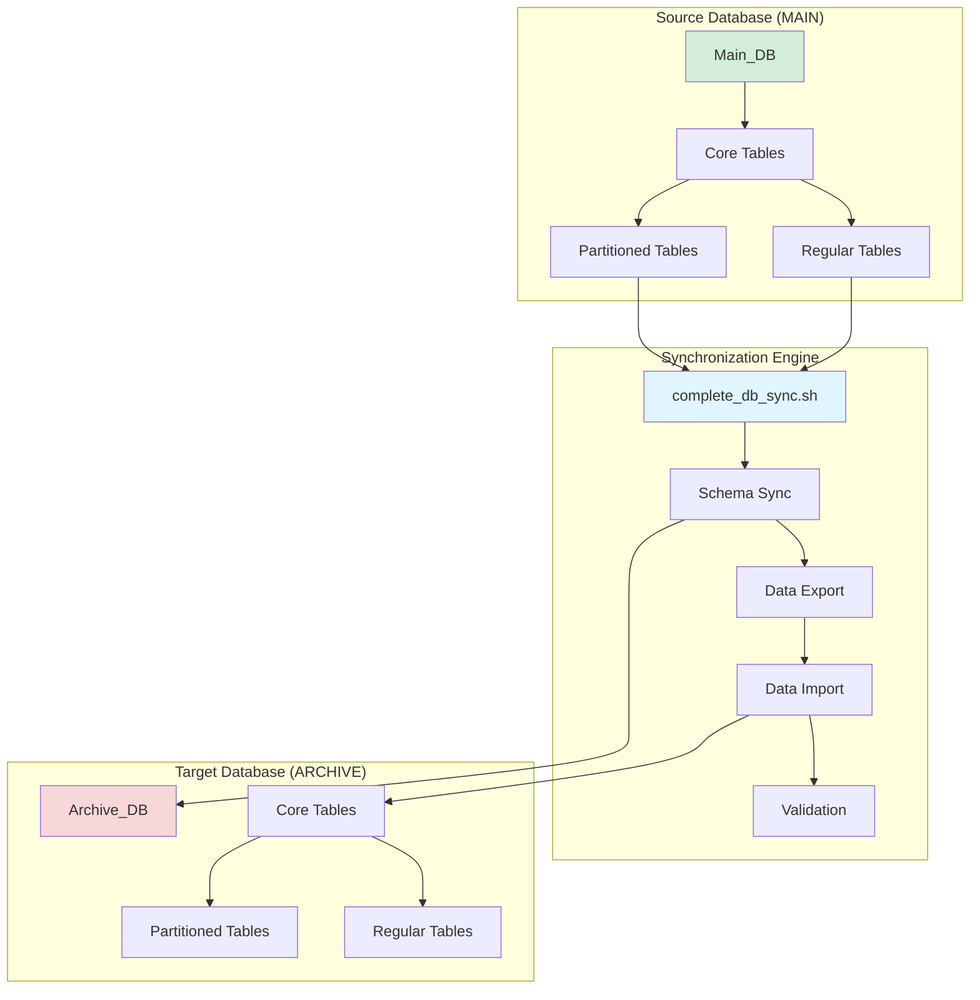
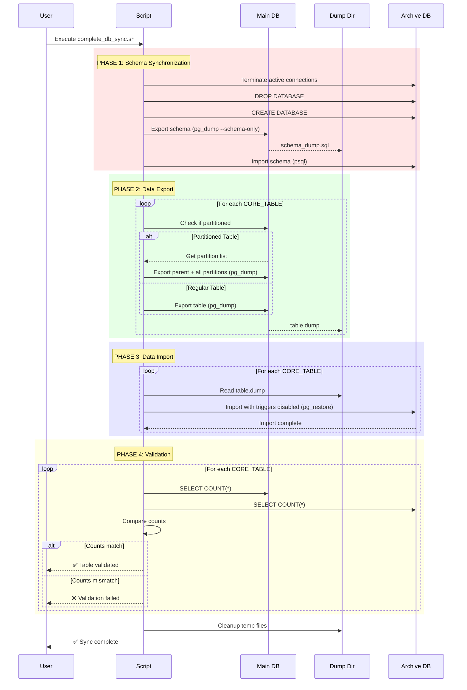

# Complete PostgreSQL Database Synchronization Script

## 📋 Overview

The `complete_db_sync.sh` script is a **production-ready PostgreSQL database synchronization tool** designed to replicate an entire database from a source (MAIN) to a target (ARCHIVE) database. It handles complex scenarios including partitioned tables, provides comprehensive error handling, graceful cancellation, and includes built-in validation.

### Key Features

- ✅ **Complete Database Sync**: Full schema and data synchronization
- 🔄 **Partitioned Table Support**: Automatically handles single and multi-level partitioned tables
- 🚀 **Parallel Processing**: Configurable parallel jobs for faster exports/imports
- 🔁 **Automatic Retries**: Built-in retry mechanism for transient failures
- 🎯 **Graceful Shutdown**: Clean cancellation with Ctrl+C handling
- 📊 **Progress Tracking**: Real-time colored output with phase tracking
- ✔️ **Data Validation**: Automatic row count validation after sync
- 🛡️ **Safe Operations**: Comprehensive error handling and rollback support
- 🎨 **High Visibility**: Color-coded logging with clear phase headers

---

## 🏗️ Architecture



---

## 📊 Workflow Diagram



---

## 🔧 Configuration

### Environment Variables

The script uses environment variables with sensible defaults:

| Variable | Default | Description |
|----------|---------|-------------|
| `MAIN_DB_HOST` | `localhost` | Source database hostname |
| `MAIN_DB_PORT` | `5432` | Source database port |
| `MAIN_DB_USER` | `postgres` | Source database username |
| `MAIN_DB_PASSWORD` | `0206` | Source database password |
| `MAIN_DB_NAME` | `Main_DB` | Source database name |
| `ARCHIVE_DB_HOST` | `localhost` | Target database hostname |
| `ARCHIVE_DB_PORT` | `5432` | Target database port |
| `ARCHIVE_DB_USER` | `postgres` | Target database username |
| `ARCHIVE_DB_PASSWORD` | `0206` | Target database password |
| `ARCHIVE_DB_NAME` | `Archive_DB` | Target database name |

### Performance Settings

| Parameter | Default | Description |
|-----------|---------|-------------|
| `RETRY_COUNT` | `3` | Number of retry attempts for failed operations |
| `PG_JOBS` | `4` | Number of parallel pg_dump/pg_restore jobs |
| `BATCH_SIZE` | `1` | Number of tables to process in parallel |

### File Paths

| Variable | Description |
|----------|-------------|
| `SCRIPT_DIR` | Auto-detected script directory |
| `TIMESTAMP` | Auto-generated timestamp (YYYYMMDD_HHMMSS) |
| `DUMP_DIR` | Temporary dump directory `./migration_dumps_${TIMESTAMP}` |
| `SCHEMA_DUMP_FILE` | Schema dump file path |

---

## 🚀 Usage

### Basic Usage

```bash
# Run with default configuration
./complete_db_sync.sh
```

### Custom Configuration

```bash
# Override defaults with environment variables
export MAIN_DB_HOST="production.example.com"
export MAIN_DB_NAME="production_db"
export ARCHIVE_DB_HOST="archive.example.com"
export ARCHIVE_DB_NAME="archive_db"
export MAIN_DB_PASSWORD="secure_password"
export ARCHIVE_DB_PASSWORD="secure_password"

./complete_db_sync.sh
```

### Interactive Configuration

```bash
# Set variables inline
MAIN_DB_HOST=source.db.com \
ARCHIVE_DB_HOST=target.db.com \
PG_JOBS=8 \
BATCH_SIZE=2 \
./complete_db_sync.sh
```

---

## 📝 Execution Phases

### Phase 1: Schema Synchronization

**Purpose**: Recreate the database structure in the target database

**Steps**:
1. Terminate all active connections to the archive database
2. Drop the existing archive database (if exists)
3. Create a fresh archive database
4. Export complete schema from main database (`pg_dump --schema-only`)
5. Import schema into archive database

**Output Example**:
```
========================================================================================
#  PHASE 1/4: Schema Synchronization  
========================================================================================

[INFO]    Terminating active connections...
[INFO]    Recreating database: Archive_DB
[INFO]    Syncing Schema...
```

### Phase 2: Data Export

**Purpose**: Extract all table data from the source database

**Features**:
- Automatically detects partitioned tables
- Recursively finds all partition levels
- Uses parallel jobs for faster exports
- Directory-format dumps for parallel processing

**Output Example**:
```
========================================================================================
#  PHASE 2/4: Data Export  
========================================================================================

[21:30:45] [EXPORT] [STARTED  ] customers                            | Standard Table
[21:30:47] [EXPORT] [DONE     ] customers                            | Size: 2.4M, Time: 2s
[21:30:47] [EXPORT] [STARTED  ] audit_logs                           | Partitioned (24 parts)
[21:30:52] [EXPORT] [DONE     ] audit_logs                           | Size: 15.2M, Time: 5s
```

### Phase 3: Data Import

**Purpose**: Load exported data into the target database

**Features**:
- Triggers disabled during import for speed
- Parallel restoration
- Foreign key constraints respected
- Automatic error recovery with retries

**Output Example**:
```
========================================================================================
#  PHASE 3/4: Data Import  
========================================================================================

[21:31:00] [IMPORT] [STARTED  ] customers                            | Restoring data...
[21:31:03] [IMPORT] [DONE     ] customers                            | Time: 3s
```

### Phase 4: Validation

**Purpose**: Verify data integrity after synchronization

**Process**:
- Compares row counts between source and target
- Reports any mismatches
- Provides summary of validation results

**Output Example**:
```
========================================================================================
#  PHASE 4/4: Validation  
========================================================================================

[INFO]    ✅ Validation Successful. All tables match.
```

---

## 🎯 Core Tables

The script synchronizes core tables from your database. Here are example table categories:

**Authentication & Users**:
- `users`, `login_sessions`, `auth_tokens`
- `password_resets`, `user_permissions`

**Customer Management**:
- `customers`, `customer_addresses`, `customer_contacts`
- `customer_preferences`, `customer_segments`

**Order Management**:
- `orders`, `order_items`, `order_history`
- `order_status`, `order_payments`

**Product Catalog**:
- `products`, `product_categories`, `product_images`
- `product_variants`, `product_reviews`

**Transaction & Billing**:
- `transactions` (partitioned)
- `invoices`, `invoice_items`
- `payments`, `payment_methods`

**Audit & Reporting**:
- `audit_logs` (partitioned)
- `system_events`, `user_activity`
- `analytics_data`, `reports`

**Inventory & Assets**:
- `inventory`, `warehouses`, `stock_movements`
- `assets`, `asset_maintenance`

*Configure your table list in the CORE_TABLES array (lines 52-89) in the script*

---

## 🛡️ Error Handling

### Retry Mechanism

The script includes a sophisticated retry system:

```bash
run_with_retry() {
    - Attempts: 3 (configurable via RETRY_COUNT)
    - Delay: 2 seconds between attempts
    - Connection error detection
    - Detailed error logging
}
```

### Graceful Shutdown

**Ctrl+C Handling**:
- Traps INT (Ctrl+C), TERM, and EXIT signals
- Kills all active background jobs
- Cleans up temporary files
- Unsets password environment variables
- Returns appropriate exit code

**Exit Codes**:
- `0`: Success
- `130`: User cancelled (Ctrl+C)
- `1`: Script failed

### Error Output

Failed operations provide detailed logs:
```
[ERROR]   Failed: Export orders
=========== ERROR DETAILS ============
pg_dump: error: connection to database failed
=========== ERROR DETAILS ============
```

---

## 🎨 Visual Feedback

### Color-Coded Logging

| Color | State | Purpose |
|-------|-------|---------|
| 🟡 Yellow | STARTED | Operation initiated |
| 🟢 Green | DONE | Operation succeeded |
| 🔴 Red | FAILED | Operation failed |
| 🔵 Cyan | INFO | Informational messages |
| 🟣 Magenta | HEADER | Phase headers |

### Log Format

```
[HH:MM:SS] [PROCESS] [STATE    ] TableName                          | Details
[21:30:45] [EXPORT ] [STARTED  ] orders                             | Standard Table
[21:30:47] [EXPORT ] [DONE     ] orders                             | Size: 1.2M, Time: 2s
```

---

## 🔍 Advanced Features

### Partitioned Table Detection

The script automatically detects and handles PostgreSQL partitioned tables:

```sql
-- Checks if table is partitioned
SELECT EXISTS (
    SELECT 1 FROM pg_class 
    WHERE relname = 'table_name' 
    AND relkind = 'p'
);
```

### Recursive Partition Discovery

Uses recursive CTE to find all partition levels:

```sql
WITH RECURSIVE partition_tree AS (
    -- Direct children
    SELECT c.oid, c.relname, c.relkind
    FROM pg_class c
    JOIN pg_inherits i ON i.inhrelid = c.oid
    JOIN pg_class p ON p.oid = i.inhparent
    WHERE p.relname = 'parent_table'
    
    UNION ALL
    
    -- Recursive children
    SELECT c.oid, c.relname, c.relkind
    FROM partition_tree pt
    JOIN pg_inherits i ON i.inhparent = pt.oid
    JOIN pg_class c ON c.oid = i.inhrelid
    WHERE pt.relkind = 'p'
)
SELECT DISTINCT relname FROM partition_tree;
```

### Parallel Processing

- **Export**: Uses `pg_dump -Fd -j $PG_JOBS` for parallel directory-format dumps
- **Import**: Uses `pg_restore -j $PG_JOBS` for parallel restoration
- **Batch Control**: `BATCH_SIZE` controls how many tables are processed concurrently

---

## 📁 File Structure

```
── migration_dumps_YYYYMMDD_HHMMSS/  # Temporary dump directory (auto-created)
  ├── schema_dump.sql          # Schema dump
  ├── customers/               # Table dump (directory format)
  ├── orders/                  # Table dump
  └── ...                      # Other table dumps
```

---

## 💡 Use Cases

### 1. Database Backup & Archive

Create periodic archives of your production database:

```bash
#!/bin/bash
# Daily archive script
export MAIN_DB_NAME="production"
export ARCHIVE_DB_NAME="archive_$(date +%Y%m%d)"
./complete_db_sync.sh
```

### 2. Testing Environment Setup

Clone production data to a test environment:

```bash
export MAIN_DB_HOST="production.db.com"
export ARCHIVE_DB_HOST="testing.db.com"
export ARCHIVE_DB_NAME="test_db"
./complete_db_sync.sh
```

### 3. Data Migration

Migrate from one server to another:

```bash
export MAIN_DB_HOST="old-server.com"
export ARCHIVE_DB_HOST="new-server.com"
export PG_JOBS=8  # Increase for faster migration
./complete_db_sync.sh
```

### 4. Development Refresh

Refresh local development database with production data:

```bash
export MAIN_DB_HOST="production.db.com"
export ARCHIVE_DB_HOST="localhost"
export ARCHIVE_DB_NAME="dev_local"
./complete_db_sync.sh
```

---

## ⚠️ Important Considerations

### Pre-requisites

1. **PostgreSQL Tools**: Ensure `pg_dump`, `pg_restore`, and `psql` are installed
2. **Network Access**: Source and target databases must be accessible
3. **Permissions**: User must have:
   - `SELECT` on all tables in source database
   - `CREATE DATABASE` privilege on target server
   - `INSERT` on all tables in target database
4. **Disk Space**: Sufficient space for temporary dumps (estimate: source DB size × 1.5)

### Security Warnings

> [!WARNING]
> **Password Handling**: Database passwords are stored in environment variables and may appear in process listings. Consider using `.pgpass` file for production environments.

> [!CAUTION]
> **Destructive Operation**: The script **DROPS and RECREATES** the target database. Ensure you have backups before running in production.

### Performance Tips

> [!TIP]
> **Optimize Parallel Jobs**: Set `PG_JOBS` to the number of CPU cores available for best performance.

> [!TIP]
> **Batch Processing**: Increase `BATCH_SIZE` to process multiple tables simultaneously, but be mindful of memory usage.

> [!TIP]
> **Network Bandwidth**: For remote databases, ensure sufficient network bandwidth. A slow connection will significantly impact transfer times.

---

## 🐛 Troubleshooting

### Common Issues

#### Issue: Connection Failures

**Symptom**: `connection to database failed`

**Solutions**:
- Verify database credentials
- Check firewall rules and network connectivity
- Ensure PostgreSQL is accepting connections (`pg_hba.conf`)
- Verify `listen_addresses` in `postgresql.conf`

#### Issue: Permission Denied

**Symptom**: `permission denied for database`

**Solutions**:
- Grant necessary privileges to the database user
- Ensure user has `CREATEDB` privilege for archive operations
- Check table-level permissions

#### Issue: Disk Space

**Symptom**: `No space left on device`

**Solutions**:
- Free up disk space in the temp directory
- Change `DUMP_DIR` to a location with more space
- Reduce `BATCH_SIZE` to limit concurrent dumps

#### Issue: Validation Failures

**Symptom**: `Validation Discrepancies Found`

**Solutions**:
- Check import logs for warnings
- Verify foreign key constraints
- Re-run the script with increased retry count
- Manually inspect mismatched tables

---

## 📊 Performance Metrics

### Expected Performance

| Database Size | Tables | Duration (PG_JOBS=4) | Duration (PG_JOBS=8) |
|---------------|--------|---------------------|---------------------|
| 1 GB | 50 | ~5 minutes | ~3 minutes |
| 10 GB | 100 | ~30 minutes | ~18 minutes |
| 50 GB | 150 | ~2 hours | ~1.5 hours |
| 100 GB | 200 | ~4 hours | ~2.5 hours |

*Performance varies based on hardware, network speed, and table complexity*

---

## 🔄 Related Scripts

### schema_data_sync_fixed.sh

An alternative approach that:
- Uses custom format dumps (`-Fc`)
- Includes progress bars
- Truncates instead of dropping/recreating database
- Suitable for incremental updates

### cm_schema_remove_constraints.sh

Utility script for:
- Removing constraints before import
- Running additional SQL files
- Useful for complex constraint scenarios

---

## 📝 Example Output

```
========================================================================================
#  SYNC CONFIGURATION  
========================================================================================
SOURCE DB (FROM):   postgres@localhost:5432 / Main_DB
TARGET DB (TO):     postgres@localhost:5432 / Archive_DB
START TIME:         2025-11-30 21:42:04
TEMP DIR:           ./migration_dumps_20251130_214204
MAX JOBS:           4
MAX TABLES:         1
========================================================================================

========================================================================================
#  PHASE 1/4: Schema Synchronization  
========================================================================================

[INFO]    Terminating active connections...
[INFO]    Recreating database: Archive_DB
[INFO]    Syncing Schema...

========================================================================================
#  PHASE 2/4: Data Export  
========================================================================================

[21:42:10] [EXPORT] [STARTED  ] users                                | Standard Table
[21:42:10] [EXPORT] [DONE     ] users                                | Size: 8.0K, Time: 0s
[21:42:10] [EXPORT] [STARTED  ] customers                             | Standard Table
[21:42:11] [EXPORT] [DONE     ] customers                            | Size: 12K, Time: 1s
...

========================================================================================
#  PHASE 3/4: Data Import  
========================================================================================

[21:45:20] [IMPORT] [STARTED  ] users                                | Restoring data...
[21:45:20] [IMPORT] [DONE     ] users                                | Time: 0s
...

========================================================================================
#  PHASE 4/4: Validation  
========================================================================================

[INFO]    ✅ Validation Successful. All tables match.

========================================================================================
#  FINAL CLEANUP  
========================================================================================

[INFO]    Removing temporary directory: ./migration_dumps_20251130_214204
✅ Script finished successfully.
```

---

## 🤝 Contributing

When modifying this script:

1. **Maintain Logging**: Use existing log functions for consistency
2. **Update Core Tables**: Add new tables to the `CORE_TABLES` array
3. **Test Partitioned Tables**: Verify changes work with partitioned tables
4. **Error Handling**: Ensure all operations use retry mechanism
5. **Documentation**: Update this README with any new features
